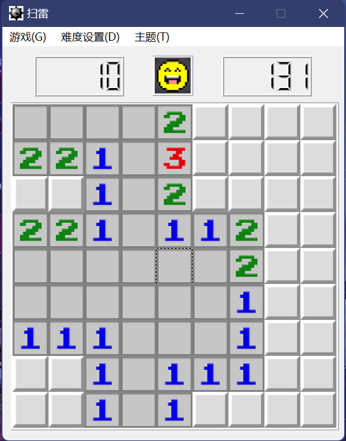
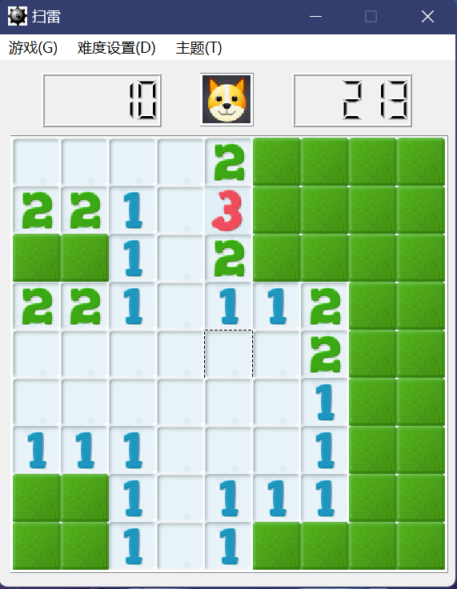
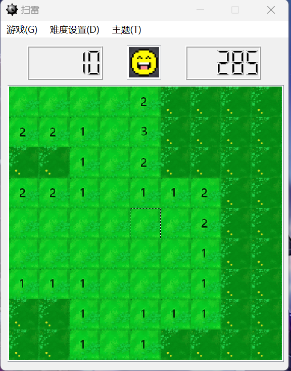
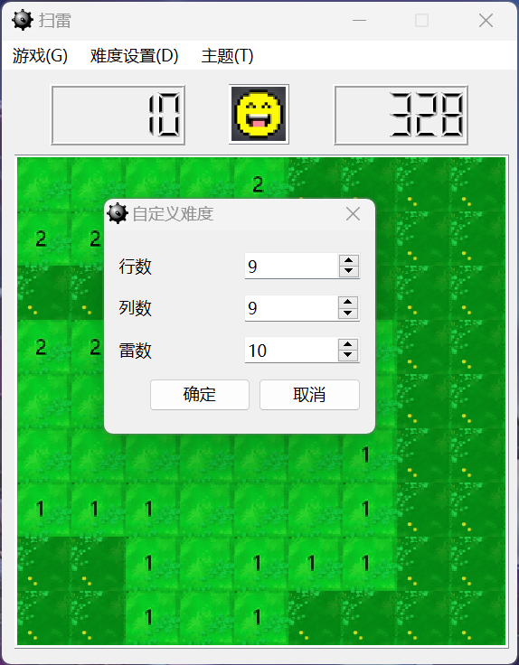

## 简介

这是一款以 Microsoft Mineswepper 作为开发标准，用 Qt 开发一款扫雷游戏。

## 特色

本项目除实现了 Microsoft Minesweeper 的基本功能，还实现了更好的布雷算法（第一次点击的周围9个格子都不是雷），提高了游戏的可玩性；增加了主题功能，美化了GUI界面。

## 开发团队

- MCJiu
- cby
- Gcoin42

## 游戏界面展示

游戏主界面

小狗主题

植物大战僵尸主题

自定义难度窗口

## 构建环境

本项目使用
- Qt 6.5.0 进行开发
- Qt Creator 10.0.2 (Community) 作为 IDE
- Desktop Qt 6.5.0 MinGW 64-bit 工具构建

## 开源协议

本项目遵循 [MIT 开源协议](LICENCE)。